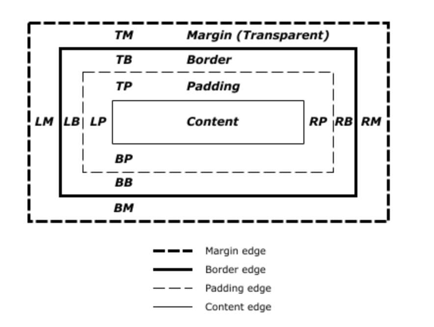

# 컨테이닝 블록 
대부분의 경우 어떤 요소의 컨테이닝 블록은 그 요소에 가장 가까운 블록 레벨 조상의 콘텐츠 영역이지만, 항상 그런 것은 아니다. 

1. 콘텐츠 영역
2. 안쪽 여백(패딩) 영역
3. 테두리 영역
4. 바깥 여백(마진) 영역


## 컨테이닝 블록의 효과
`element`의 크기와 위치는 컨테이닝 블록의 영향을 받는다.  
`백분율` 값을 사용한 width, height, padding, margin 속성의 값과 절대적 위치(absolute나 fixed 등)로 설정된 요소의 오프셋 속성 값은 자신의 컨테이닝 블록으로부터 계산됩니다.
```CSS
div{
    width : 100%;
}
```

## 컨테이닝 블록 식별하기

1. position 속성이 static이나 relative면, 컨테이닝 블록은 블록 컨테이너(inline-block, block, list-item 등의 요소) 또는 서식 문맥을 형성하는 요소(table, flex, grid, 아니면 블록 컨테이너 자기 자신)의 콘텐츠 영역입니다.
2. position 속성이 absolute인 경우, 컨테이닝 블록은 position 속성 값이 static이 아니고(fixed, absolute, relative, sticky) 가장 가까운 조상의 내부 여백 영역입니다.
3. position 속성이 fixed인 경우, 컨테이닝 블록은 뷰포트나 (페이지로 나뉘는 매체에선) 페이지 영역입니다.
4. position 속성이 absolute나 fixed인 경우, 다음 조건 중 하나를 만족하는 가장 가까운 조상의 내부 여백 영역이 컨테이닝 블록이 될 수도 있습니다.
    1. transform이나 perspective 속성이 none이 아님.
    2. will-change 속성이 transform이나 perspective임.
    3. filter 속성이 none임. (Firefox에선 will-change가 filter일 때도 적용)
    4. contain 속성이 paint임.