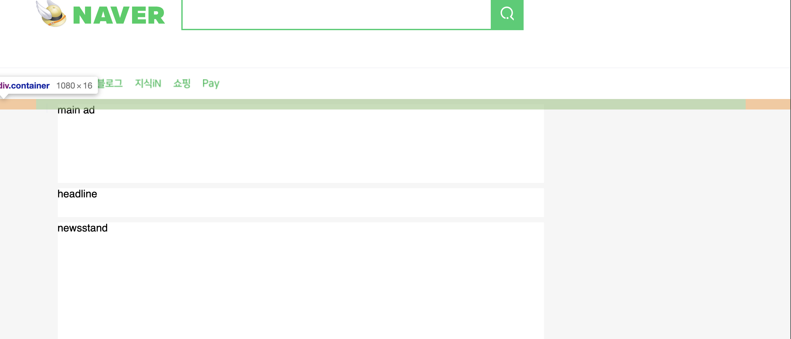
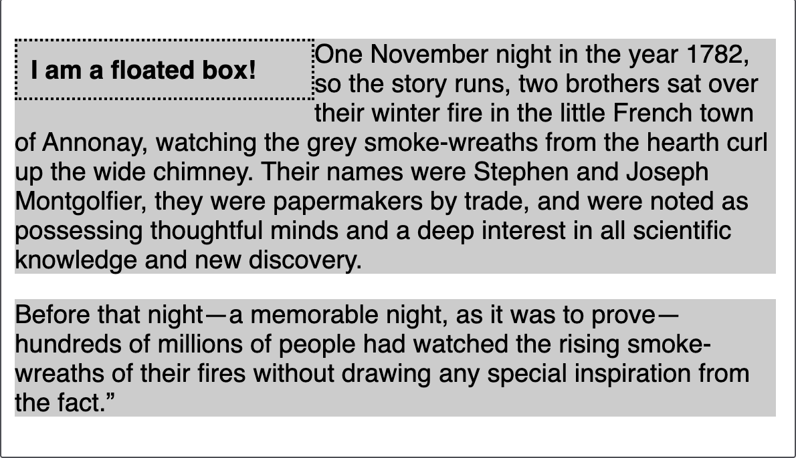

# Block Formatting Context

## 이 개념이 필요한 이유. 

``` HTML
<div class="container">
    <div class="column-left">
        <!-- 생략 -->
    </div>
    <div class="column-right">
         <!-- 생략 -->
    </div>
    <!-- 생략 -->
</div> 
```

```CSS
.container{
    margin: 0 auto;
    width:1080px; 
    padding: 8px 0;
    /* display:inline-block; */
    /* overflow: hidden; */
}
.column-left{
    float:left;
    width: 740px;
}
.column-right{
    position: relative;
    float: right;
    width: 332px;
}
```



위의 결과물과 같이 `container`의 `content` 영역의 사이즈가 0이다. 
이는 아래의 내부 `div` 태그가 `float` 속성을 가지고 있기 때문이다. 

## Flow

BCF의 개념을 잘 이해하기 위해서는 flow에 대한 이해를 가지고 있어야 한다. 일반적으로 html의 flow는 위에서 아래로 진행되는데, 몇몇 예외적인 경우에는 이 flow를 벗어나게 된다. 

* floated items
* items with position: absolute (including position: fixed which acts in the same way)
* the root element (html)

flow를 벗어난 `items`는 새로운 BFC를 만들고, 그 아이템 내부의 모든 것들은 페이지와는 분리된 하나의 작은 레이아웃으로 볼 수 있다. 

```CSS
p {
    background-color: #ccc;
}
.float {
    float: left;
    font-weight: bold;
    width: 200px;
    border: 2px dotted black;
    padding: 10px;
}
```

```HTML
<div class="box">
    <div class="float">I am a floated box!</div>
    <p>One November night in the year 1782, so the story runs, two brothers sat over their winter fire in the little French town of Annonay, watching the grey smoke-wreaths from the hearth curl up the wide chimney. Their names were Stephen and Joseph Montgolfier, they were papermakers by trade, and were noted as possessing thoughtful minds and a deep interest in all scientific knowledge and new discovery.</p>
    <p>Before that night—a memorable night, as it was to prove—hundreds of millions of people had watched the rising smoke-wreaths of their fires without drawing any special inspiration from the fact.”</p>
</div>
```

;

`float` 뒤에 따라오는 `<p>`의 색이 아래에 깔리는 것을 볼 수 있다. `<p>` 태그는 여전히 `normal flow`를 따라서 화면에 비춰지고 있다. 그렇기 때문에 `floated item` 과의 간격을 만들고 싶다면 그 floated item에 마진 값을 주어야 한다. 플로우 내에 있는 컨텐츠에 무슨 속성을 추가하더라도 그러한 간격을 가지게 할 수 없다. 
--> 즉, 지금 위의 `p` 태그 같은 경우에는 normalr flow를 가지고 그냥 진행이 되고 있는데, `float` 속성을 가진 하나의 `div`태그가 새로운 BCF를 가지고 끼어든 꼴이 되는 격이다. 

## BCF

[참고: mdn](https://developer.mozilla.org/ko/docs/Web/Guide/CSS/Block_formatting_context)

* float
* inline-block
* overflow가 visible이 아닌 요소

A block formatting context contains everything inside of the element creating it.

블록 서식 문맥이 적용되면 기존의 흐름에서 벗어난 다른 차원이 열리는 효과를 가져온다.

예를 들면 position: absolute가 적용되면 기존 요소들은 아래에 있고 해당 요소가 위로 뜨는 것과 같이 다른 dimension을 갖는다.

아래의 경우들은 해당 요소들을 한단계 위로 띄운다고 생각하자. 음.. 보다 정확하게는 새로운 문맥이 만들어진다.

이들이 유용하게 적용되는 경우는 일부 컨텐츠를 배경 혹은 부모에게서 분리하여 네거티브 마진을 적용하거나, 정렬을 하거나 등등 독립적인 사용을 원할 때 유용하다.  [출처](https://susu91.tistory.com/155)

## Solution

처음의 문제를 해결하기 위해서는 `container`의 속성에 `overflow:auto`를 추가해주면 된다. 그렇게 하면 `container`가 BCF를 만들고 BCF의 특성상 BCF를 생성한 엘리먼트 내부의 모든 것을 감싸기 때문에 하위의 `div`들 (float이 적용된)을 포함할 수 있게 되는 것이다. 
